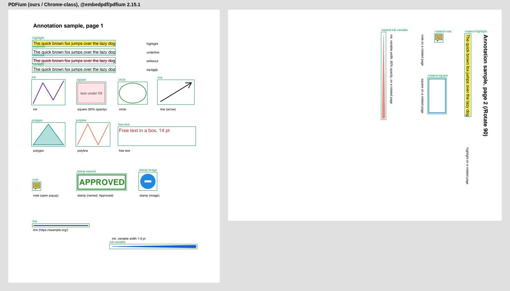
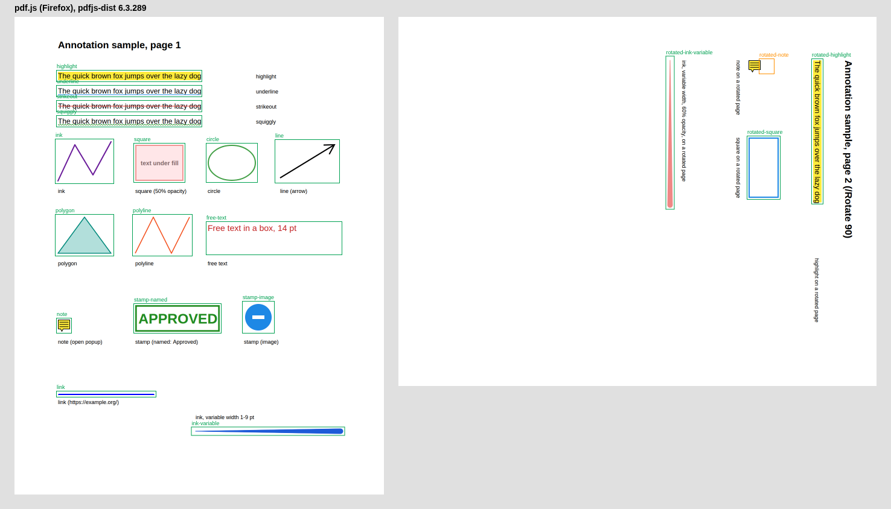

# Annotation cross-viewer matrix (M2)

Spec: [viewer-annotations.md §7](../specs/viewer-annotations.md). The matrix is automated:
two independent renderers that run headless (our PDFium build, which is what Chrome-class
viewers use, and pdf.js, which is what Firefox uses) draw the sample and a checker compares
every annotation with what the sample says it should look like. Acrobat Reader, Preview and
Edge cannot be automated here; they get an optional five-minute spot check (below).

Sample: [`samples/annotations-sample.pdf`](samples/annotations-sample.pdf), written by the
app's own PDFium adapter (`createAnnotation` + `save()`, the path export uses) and checked
with `checkAnnotationConformance` before it is written. Page 1 has one annotation of each
kind with a printed label next to it (the 50 % square covers the words "text under fill")
and a variable-width ink (1 → 9 pt along a straight stroke, nominal width 4 pt; ADR-0018);
page 2 has `/Rotate 90` with a highlight, a note, a square and a variable-width ink at 60 %
opacity. What each annotation is and what a viewer must show for it lives in one place,
`tools/qa/annotation-sample-plan.ts`, which both the generator and the checker use.

## Automated results

```sh
pnpm --filter @pdf-editor/qa-tool matrix        # checks the committed sample
pnpm --filter @pdf-editor/qa-tool matrix:fresh  # regenerates the sample first
```

`tools/qa/annotation-matrix.ts` runs in Vitest browser mode (headless Chromium, about 10 s)
and renders both pages at 2× with:

- **PDFium (ours / Chrome-class)**: the app's `PdfiumAdapter` (`renderPage`), and its
  `listAnnotations` for the data our comment UI shows.
- **pdf.js (Firefox)**: `pdfjs-dist` the way Firefox shows a page: the canvas render with
  annotation appearances (`AnnotationMode.ENABLE_FORMS`) plus pdf.js's own annotation layer
  (notes are drawn there on their own upright canvas; popups and links are HTML),
  screenshotted. `page.getAnnotations()` and the layer's popups stand in for Firefox's
  comment UI. Everything loads offline from `node_modules` (the legacy build, which has the
  same rendering code as the one Firefox ships but also runs in older Chromium builds).

For every row the checker looks at:

- **Pixels** (in the region the plan gives, mapped through the page rotation): something is
  drawn; the dominant inked colour is the expected one (within a tolerance; the translucent
  square must show its fill at 50 %, not the opaque colour); the colour stays inside the
  region (4 pt slack) and spans it; text under the highlight and under the translucent
  square stays readable (dark pixels present); underline, strikeout and squiggly strokes sit
  at the right height of the text line; the link shows its blue underline appearance and
  nothing else; on page 2 the note icon matches the upright page-1 icon (not turned) and
  hangs from the display position of its `/Rect`'s upper-left corner; the variable-width
  inks are drawn as wide as planned (within 0.6 pt) at 10, 30, 50, 70 and 90 % of the
  stroke, centred on it, and at least 3× wider at the end than at the start (coverage of
  the expected colour integrated across the stroke, through the page rotation).
- **Data** as the renderer reports it: subtype, `/Rect` covering the geometry, QuadPoints,
  contents; the note text and `/Open true` (for pdf.js also: the popup is shown on load or
  on click with the text); the link's URI (for pdf.js also: an `<a href>` over the link);
  for the variable-width inks, the stroke width the renderer reports (`/BS /W`) is the
  nominal width.

Cell values: `ok`; `fail: <what>` (the command exits non-zero, so CI goes red); or
`differs: <what>` for a renderer behaviour that departs from ISO 32000 for every file, not
because of the sample. Such behaviours are listed, one by one, in `KNOWN_DIFFERENCES` in the
checker and do not fail the run; any other problem in the same cell still does. The table is
rewritten on every run; the versions in its header are the ones that ran.

<!-- matrix:auto:start -->
<!-- Written by `pnpm --filter @pdf-editor/qa-tool matrix` (tools/qa/annotation-matrix.ts); do not edit by hand. -->

| Check | PDFium (ours / Chrome-class), @embedpdf/pdfium 2.15.1 | pdf.js (Firefox), pdfjs-dist 6.3.289 |
| --- | --- | --- |
| Highlight (Multiply blend, text stays readable, comment) | ok | ok |
| Underline | ok | ok |
| Strikeout | ok | ok |
| Squiggly | ok | ok |
| Ink | ok | ok |
| Square (50% opacity, interior colour, text under the fill visible) | ok | ok |
| Circle | ok | ok |
| Line with open arrow | ok | ok |
| Polygon (interior colour) | ok | ok |
| Polyline | ok | ok |
| Free text (14 pt, red) | ok | ok |
| Note: icon renders | ok | ok |
| Note: text available to the comment UI | ok | ok |
| Note: popup open by default (`/Open true`) | ok | ok |
| Stamp, named (`Approved`, generated appearance) | ok | ok |
| Stamp, image (PNG) | ok | ok |
| Link (URI https://example.org/; its blue underline appearance only) | ok | ok |
| Page 2 (`/Rotate 90`): highlight over its text line | ok | ok |
| Page 2: note icon upright (NoRotate: not turned with the page), text in the comment UI | ok | ok |
| Page 2: note icon hung from the /Rect upper-left corner (ISO 32000-2 §12.5.3) | ok | differs: icon placed in the rotated /Rect footprint (x 580–600, y 72–92 pt), not hung from the /Rect's upper-left corner (x 600–620, y 72–92 pt) |
| Page 2: square placed in display space | ok | ok |
| Ink, variable width (appearance) | ok | ok |
| Ink `/BS /W` equals the nominal width | ok | ok |

45 ok, 1 differs, 0 fail (of 46). Contact sheets: [pdfium](samples/annotations-matrix-pdfium.png), [pdfjs](samples/annotations-matrix-pdfjs.png).
<!-- matrix:auto:end -->

Contact sheets (each checked region outlined: green ok, amber differs, red fail):





Set `QA_MATRIX_EVIDENCE_DIR=<dir>` to also get a 2× crop of every region that is not `ok`.

### Notes on the results

- **Note icons on rotated pages (NoRotate).** ISO 32000-2 §12.5.3 keeps a NoRotate
  annotation upright with the upper-left corner of its `/Rect` fixed; text annotations
  behave as NoRotate (§12.5.6.4) and the engine writes `/F 28` (Print, NoZoom, NoRotate) on
  notes. On `/Rotate` pages the icon stays upright in conformant viewers (Acrobat, pdf.js,
  our PDFium build), while some PDFium-based viewers turn it with the page; that is the
  viewer's non-conformance, not the file's. Our PDFium build honours the flag: with it
  cleared the checker reports the icon turned 90°. pdf.js keeps the icon upright but places
  it inside the rotated `/Rect` footprint, one icon width left of the ISO position (its
  annotation layer's `.norotate` transform): recorded as `differs`.
- **Link underline in pdf.js.** EmbedPDF writes links with a blue 2 pt underline appearance
  and `/BS << /S /U /W 2 >>` but no `/C`. pdf.js draws the appearance and, in its
  annotation layer, a CSS border from `/BS` in the default colour black, so Firefox shows a
  black line under the blue one; PDFium draws only the appearance. Writing `/C [0 0 1]`
  (the appearance colour) on links makes them agree (checked on a patched copy of the
  sample: the row turns `ok`). Until the engine does, the row is `fail` for pdf.js.
- **NoZoom** is ignored by most renderers, ours included: note icons scale with the zoom.
  Cosmetic; not checked.
- **Variable-width ink** lives in the ink's appearance stream (ADR-0018): `/InkList` keeps
  the centre line and `/BS /W` the nominal width, so a viewer that redraws ink from
  `/InkList` (an editor rebuilding the appearance) shows it at the nominal width. Both
  renderers here draw the appearance.
- The PDFium column is our build (`@embedpdf/pdfium`). Chrome and Edge ship their own,
  newer PDFium builds with their own viewer UI; Firefox ships its own pdf.js version.

### What the automated matrix does not prove

- **Printing**: nothing is printed. Conformance only asserts the Print flag.
- **Real comment UIs**: Acrobat's Comments pane, Preview's Highlights and Notes, Firefox's
  sidebar. Chrome's viewer has no comment UI at all. The pdf.js annotation layer and the
  data each renderer reports are a proxy for them.
- **Other viewers and versions**: Acrobat, Preview (Apple's PDFKit), Edge, and the exact
  PDFium and pdf.js builds that Chrome and Firefox ship at a given time.
- **Interaction**: clicking the link (only its target and area are checked), hovering,
  editing or moving annotations in another viewer, keyboard and screen readers.
- **Exact appearance**: checks are tolerant (colour within a tolerance, placement within
  4 pt, one zoom level). A subtly different line ending or font is not caught; the contact
  sheets are there for a human glance.

## Manual spot check (optional for the release)

Five minutes, only for the viewers that cannot be automated. It is not required for the
release; do it when one of these viewers is at hand, or when a user reports a difference.

1. Open [`samples/annotations-sample.pdf`](samples/annotations-sample.pdf) in the viewer
   (Acrobat Reader: also open the Comments pane; Preview: View → Show Markup Toolbar).
2. Open the [PDFium contact sheet](samples/annotations-matrix-pdfium.png) next to it.
3. Confirm nothing differs: every outlined annotation is there, in its colour; the
   highlight and the square let their text show through; the two variable-width inks taper
   from thin to thick; on page 2 the note icon is upright; the note text appears in the
   viewer's comment UI; the link opens https://example.org/. Optionally print to PDF and
   check that the annotations are printed.
4. Record the result below. File an issue for a difference, linking this file.

| Viewer | Version, OS | Date | Result (`ok` or what differs) |
| --- | --- | --- | --- |
| Acrobat Reader | | | untested |
| Preview (macOS) | | | untested |
| Edge | | | untested |

## Regenerating the sample

Regenerate it when the engine changed (it is committed, so testers without a toolchain can
use it as is), then run the matrix:

```sh
pnpm --filter @pdf-editor/qa-tool matrix:fresh
```

`sample` runs `tools/qa/make-annotation-sample.ts` in Vitest browser mode (the adapter needs
PDFium's WASM; it runs on the hosted engine with raw access, as in the app's PDFium worker,
so variable-width inks get the engine's appearance), asserts conformance and writes the
file through Vitest's `commands.writeFile`. The output is reproducible: /NM values come from the plan, every date
is 2026-01-01 (the clock is frozen while the adapter saves) and the stamp image is drawn
pixel by pixel, so a regeneration changes the file only when the engine's output changed.

## What the engine guarantees (checked in CI)

`checkAnnotationConformance` (packages/engine/src/annotations/conformance.ts) runs on every
saved document in the engine tests and during export verification when annotations were
edited: `/AP /N` present (links and popups exempt), `/Rect` large enough for the appearance
after its `/Matrix`, QuadPoints in upper-left, upper-right, lower-left, lower-right order and
inside `/Rect`, `/P` pointing at the page, unique `/NM`, Print flag, `/M`, an ExtGState
matching `/CA` when opacity < 1, Multiply blend for highlights, and popups linked both ways
(`/Parent` and `/Popup`). The matrix above adds how two real renderers draw and expose them.
